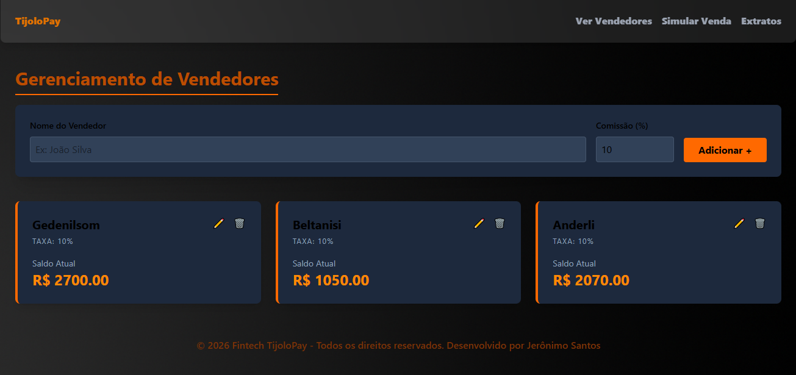
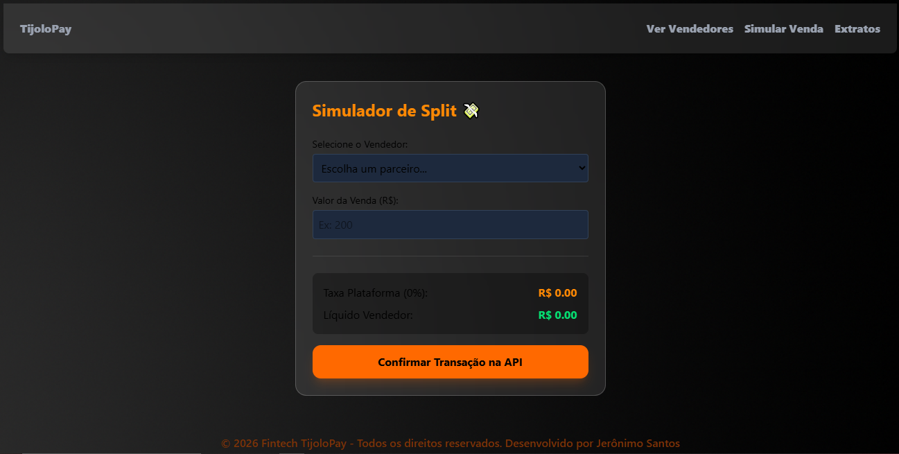
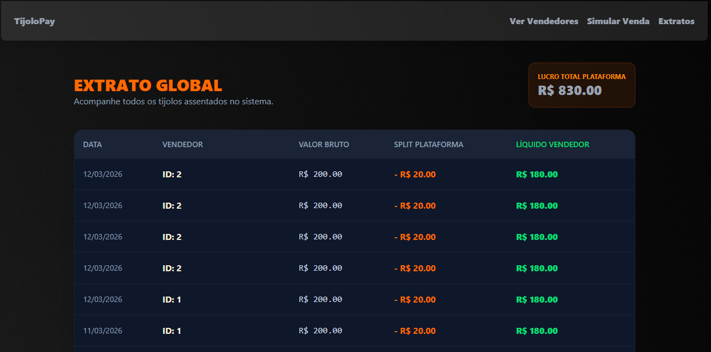

# 🚀🧱🟠 Fintech TijoloPay: Projeto Full-Stack
Desenvolvimento do TijoloPay, uma aplicação Full-stack que resolve um desafio real de marketplaces: o Split de Pagamentos. O nome é uma homenagem à solidez do setor de construção brasileiro (uma referência à minha admiração por cases como o da MadeiraMadeira) e o design foi inspirado na fluidez da Inter.

## 🎯 Objetivo Principal
Construção do zero de uma aplicação Full-Stack utilizando como base a API desenvolvida anteriormente aplicando boas praticas, regras de négocio e seguir o conceito de componentização.

## 🚨 Problematização
As plataformas de marketplace precisam dividir os pagamentos automaticamente. Esta Aplicação resolve esse problema calculando a comissão da plataforma e o saldo líquido do vendedor no momento da transação, garantindo a integridade dos dados financeiros.

## 💡 Solução
Criação de uma Aplicação Full-Stack moderna e escalavel para resolver o desafio.

## 🧠 Regra de negócio: A divisão inteligente
O cálculo da divisão é o cerne da aplicação. Quando uma venda no valor de $V$ ocorre para um vendedor com uma taxa de comissão de $C$:
Essa lógica garante transparência fiscal e operacional, eliminando erros manuais na distribuição de lucros.


## 🧰 Tecnologias Utilizadas

| Camadas | Tecnologias | Versão | 
|-------|--------------|---------|
| Frontend | ![React][react-url] | v^19.2.0 |
| Frontend | ![Vite][vite-url] | v^7.3.1 |
| Frontend | ![Typescript][ts-url] | v~5.9.3 |
| Stylization | ![TailwindCSS][tailwind-url] | v^4.2.1 |
| Backend | ![Node.js][node-url] | v22.15.0 |
| Backend | ![Express][express-url] | v5.2.1 |
| Database | ![JSONServer][json-server-url] | v22.15.0 |
| Tools | ![GIT][git-url] | v2.46.0.1 |
| Tools | ![Insomnia][insomnia-url] | v12.4.0 |

## 🎨 Frontend 
No frontend a parte visual e a marca visual da aplicação foi construida com as tecnologias mais modernas e demandadas pelo mercado contendo quatro paginas com responsabilidades deferentes, interligadas e totalmente responsivas para qualquar tela de dispositivo. A organização foi baseada na arquitetura MVC e componentização para melhor reotilização em outras partes do projeto.

## 📚 Processo de Desenvolvimento
- **Primeiro:** Começando pela arquitetura fazendo a instalação e configuração do ecosistema Vite que oferece um ambiente de desenvolvimento extremamente rápido, o TypeScript garante que os "tijolos" (dados) se encaixem sem erros de tipo, e o Tailwind v4 permite criar a identidade visual de forma atômica.
- **Segundo:** Conexão com API usando o Axios e criação do objeto "vendedorService" com métodos async.
- **Terceiro:** Hook e Tipagem onde criei a pasta hooks com a função "useVendedores" para manipular o Estado(State) e a Lógica de Sincronização. Separei as tipagens em um arquivo à parte para evitar referências circulares.
- **Quarto:** Criação das Paginas e Roteamento organizando em "Home", "Dashboard", "Simulador" e "Extrato". O "Dashbord" foi o centro do Crud. Para que essas páginas funcionem adicionei o React Router DOM, que é o "corredor" que conecta cada um desses cômodos da aplicação.

## 🌟 Funcionalidades Principais
- **```CRUD Completo de Parceiros:```** Adição, edição e exclusão de vendedores com persistência de dados.
- **```Calculadora de Split em Tempo Real:```** Simulação visual de como o valor bruto será dividido entre plataforma e vendedor.
- **```Gestão de Saldos:```** Atualização automática do saldo do vendedor após cada confirmação de venda.
- **```Extrato Global:```** Histórico detalhado de transações para auditoria e controle de lucro.
- **```UI/UX Premium:```** Interface inspirada na Inter.co, efeitos de glassmorphism e alta responsividade.

## 📸 Imagens do Projeto

### Página Home


### Página Vendedores


### Página Split


### Página Extrato Global


## 🔗 Backend
No backend a API REST foi desenvolvida em Node.js que simula a operação de um mecanismo de pagamento com valores divididos entre a plataforma e os vendedores. O projeto aplica padrões arquitetônicos profissionais para garantir escalabilidade e fácil manutenção.

## 📚 Processo de Desenvolvimento
Todas as etapas essenciais que eu precisava para desenvolver e concluir a solução do problema.

- **Primeiro:**, comecei organizando as pastas e arquivos do projeto usando a arquitetura MVC.
- **Segundo:**, comecei desenvolvendo o banco de dados de teste que seria usado pela API.
- **Terceiro:**, comecei a construir as regras de negócio para o aplicativo no controlador.
- **Quarto:**, concentrei-me no desenvolvimento do modelo do aplicativo, ajustando a integração com o banco de dados.
- **Quinto:**, comecei definindo as rotas da API seguindo os métodos HTTP (GET, POST, PUT e DELETE) depois adicionei um arquivo de teste às rotas da API.

## 📬 Endpoints da API

### 01) Lista que busca todos os Vendedores
- **Endpoint:** **```http://localhost:3000/pagamentos/vendedores```**
- **Método HTTP:** **```GET```**
- **Descrição:** Exibi uma lista com todos os Vendodores existentes no Banco de Dados.

### Parâmetro de Requisição
- **Id** Identificador único para cada Vendedor
- **nome** Nome do Vendedor
- **saldo** Quanto de dinheiro o Vendedor possui
- **comissao_percentual** Quanto de taxa da plataforma a ser paga
- **longitude** Distancia que mora o Vendedor
- **latitude** Altura que mora o Vendedor

### Exemplo de Resposta
```
[ 
    {
	    "id": 1,
	    "nome": "Gedenilsom",
	    "saldo": 2700,
	    "comissao_percentual": 10,
	    "longitude": "1.1",
	    "latitude": "3.4"
    },
    {
		"id": 2,
		"nome": "Beltanisi",
		"saldo": 1050,
		"comissao_percentual": 10,
		"longitude": "2.5",
		"latitude": "2.4"
	},
	{
		"id": 1773078527392,
		"nome": "Anderli",
		"saldo": 2070,
		"comissao_percentual": 10,
		"longitude": "2.5",
		"latitude": "1.4"
	}
]
```

### 02) Busca precisa de Vendedor único
- **Endpoint:** **```http://localhost:3000/pagamentos/vendedores/id```**
- **Método HTTP:** **```GET```**
- **Descrição:** Mostra apenas um único Vendedor

### Parâmetro de Requisição
- **Id** Identificador único para cada Vendedor
- **nome** Nome do Vendedor
- **saldo** Quanto de dinheiro o Vendedor possui
- **comissao_percentual** Quanto de taxa da plataforma a ser paga
- **longitude** Distancia que mora o Vendedor
- **latitude** Altura que mora o Vendedor

### Exemplo de Resposta
```
{
	"id": 1,
	"nome": "Gedenilsom",
	"saldo": 2700,
	"comissao_percentual": 10,
	"longitude": "1.1",
	"latitude": "3.4"
}
```

### 03) Listar todas as Transações
- **Endpoint:** **```http://localhost:3000/pagamentos/transacoes```**
- **Método HTTP:** **```GET```**
- **Descrição:** Lista todas as Transações feitas salvas no Banco de Dados

### Parâmetro de Requisição
- **id** Identificador único para cada Transação
- **vendedorId** Identificador único do Vendedor que fez a Transação
- **valorBruto** Valor total do Pagamento
- **split** Calcula o valor da plataforma e o valor líquido do vendedor
- **plataforma** Valor da taxa da Plataforma
- **vendedor** Valor líquido do Vendedor
- **data** Dia real da realização da Transação

### Exemplo de Resposta
```
[
    {
		"id": 1773005550820,
		"vendedorId": 2,
		"valorBruto": 200,
		"split": {
			"plataforma": 40,
			"vendedor": 160
		},
		"data": "2026-03-08T21:32:30.820Z"
	}
]
```

### 04) Atualizar Vendedores 
- **Endpoint** **```http://localhost:3000/pagamentos/vendedores/id```**
- **Método HTTP:** **```PUT```**
- **Descrição** Atualiza um vendedor especifico com novos dados

### Parâmetro de Requisição
- **Id** Identificador único para cada Vendedor
- **nome** Nome do Vendedor
- **saldo** Quanto de dinheiro o Vendedor possui
- **comissao_percentual** Quanto de taxa da plataforma a ser paga
- **longitude** Distancia que mora o Vendedor
- **latitude** Altura que mora o Vendedor

### Exemplo de Resposta
```
{
	"id": 1,
	"nome": "Gedenilsom",
	"saldo": 2700,
	"comissao_percentual": 10,
	"longitude": "1.1",
	"latitude": "3.4"
}
```

### 05) Cria um novo Vendedor
- **Endpoint** **```http://localhost:3000/pagamentos/vendedores```**
- **Método HTTP:** **```POST```**
- **Descrição** Cria um novo Vendedor com novos dados

### Parâmetro de Requisição
- **Id** Identificador único para cada Vendedor
- **nome** Nome do Vendedor
- **saldo** Quanto de dinheiro o Vendedor possui
- **comissao_percentual** Quanto de taxa da plataforma a ser paga
- **longitude** Distancia que mora o Vendedor
- **latitude** Altura que mora o Vendedor

### Exemplo de Resposta
```
{
	"id": 1,
	"nome": "Gedenilsom",
	"saldo": 2700,
	"comissao_percentual": 10,
	"longitude": "1.1",
	"latitude": "3.4"
}
```

### 06) Calcular Split de pagamentos
- **Endpoint** **```http://localhost:3000/pagamentos/split```**
- **Método HTTP:** **```POST```**
- **Descrição** Calcula com o método Split os pagamentos feitos pelos Vendedores

### Parâmetro de Requisição
- **vendedorId** Identificador único para cada Vendedor
- **valorTotal** Valor realizado pela venda ou compra de um produto ou serviço
- **mensagem** Mensagem de confirmação do Split realizado com sucesso
- **detalhes** Detalhes da Transação
- **id** Identificador único da Transação
- **vendedorId** Identificador único do vendedor da transação
- **valorBruto** Mesmo valor atribuido ao valorTotal
- **split** Calcula o valor da plataforma e o valor líquido do vendedor
- **plataforma** Valor da taxa da Plataforma
- **vendedor** Valor líquido do Vendedor
- **data** Dia real da realização da Transação

### Exemplo do Body
```
{
  "vendedorId": 1773078527392,
  "valorTotal": 600
}
```

### Exemplo de Resposta
```
{
	"mensagem": "Split de pagamento realizado!",
	"detalhes": {
		"id": 1773249296164,
		"vendedorId": 1773078527392,
		"valorBruto": 600,
		"split": {
			"plataforma": 60,
			"vendedor": 540
		},
		"data": "2026-03-11T17:14:56.164Z"
	}
}
```

### 07) Deletar vendedor 
- **Endpoint:** **```http://localhost:3000/pagamentos/vendedores/id```**
- **Método HTTP:** **```DELETE```**
- **Descrição** Exclui um vendedor específico no Banco de Dados

## 📝 Pre-requisitos
Antes de começar, certifique-se de ter os seguintes programas instalados em seu computador:

1. [**Git**](https://git-scm.com/downloads) – para clonar o repositório do projeto.
2. [**Node.js**](https://nodejs.org/) - para executar localmente.
3. [**VS Code**](https://code.visualstudio.com/) *(Opcional, mas recomendado.)*

## ✅ Passo a Passo para Instalação

1. Clone o repositório do projeto para sua máquina:
```
git clone https://github.com/JeronimoSantos/Projeto-Fintech-Split-de-Pagamentos.git
```

2. Acesse a pasta do projeto:
```
cd projeto-fintech-split-de-pagamentos
```

3. Instale as dependecias do Backend:
```
cd backend
npm install
npm run dev
```

4. Instale as dependecias do Frontend:
```
cd frontend
npm install
npm run dev
```

5. Para garantir que as regras financeiras estejam corretas, execute o conjunto de testes nativos:
```
cd backend
node --test src/test/test.js
```

<!-- LINKS THE BAGDES -->
[react-url]: https://img.shields.io/badge/React-%2320232a.svg?style=for-the-badge&logo=react&logoColor=%2361DAFB
[vite-url]: https://img.shields.io/badge/Vite-%23646CFF.svg?style=for-the-badge&logo=vite&logoColor=white
[ts-url]: https://img.shields.io/badge/TypeScript-%23007ACC.svg?style=for-the-badge&logo=typescript&logoColor=white
[tailwind-url]: https://img.shields.io/badge/Tailwind_CSS-%2338B2AC.svg?style=for-the-badge&logo=tailwind-css&logoColor=white
[node-url]: https://img.shields.io/badge/node.js-%23339933.svg?style=for-the-badge&logo=nodesdotjs&logoColor=white
[express-url]: https://img.shields.io/badge/express.js-%23000000.svg?style=for-the-badge&logo=express&logoColor=white
[json-server-url]: https://img.shields.io/badge/JSON_Server-%23000000.svg?style=for-the-badge&logo=json&logoColor=white
[git-url]: https://img.shields.io/badge/git-%23F05033.svg?style=for-the-badge&logo=git&logoColor=white
[insomnia-url]: https://img.shields.io/badge/Insomnia-%234000BF.svg?style=for-the-badge&logo=insomnia&logoColor=white
